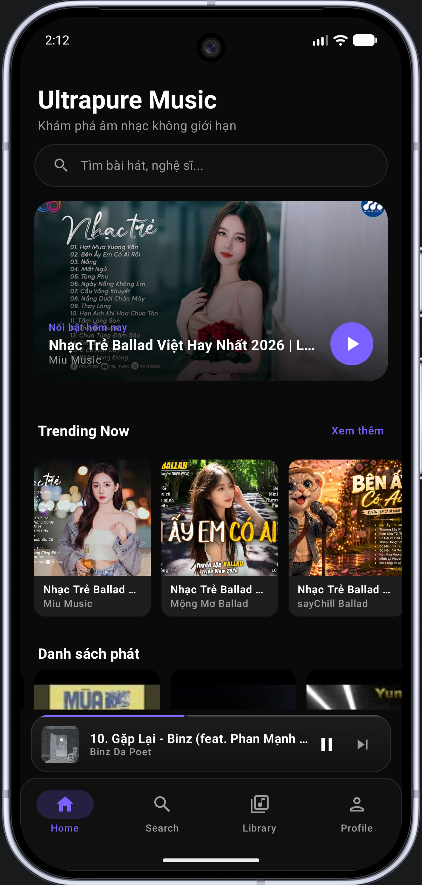
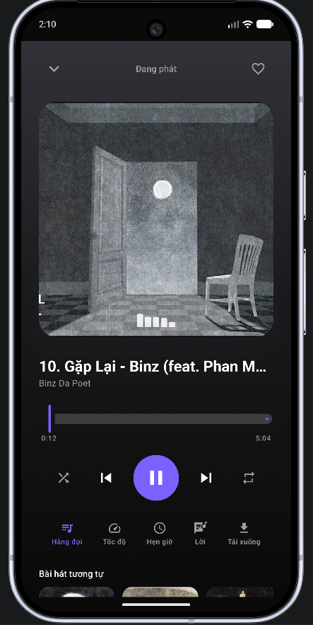
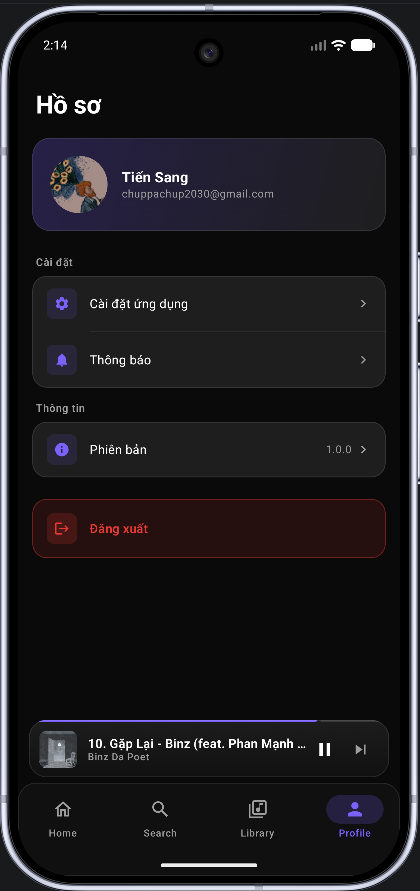
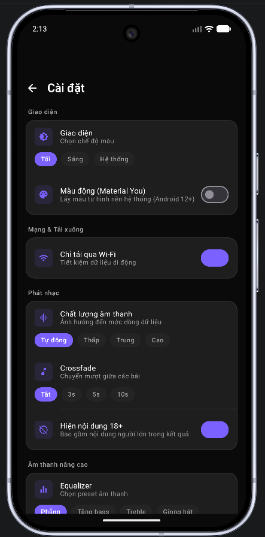

<p align="center">
  
  
  
  
  
  
</p>

<h1 align="center">Ultrapure Music</h1>

<p align="center">
  <strong>A self-hosted personal music streaming app powered by YouTube</strong>
</p>

<p align="center">
  Stream any track • Sync your playlists • Discover trending music • Taste-based recommendations
  <br>
  All wrapped in a dark glassmorphism UI.
</p>

<p align="center">
  
  
  
  
  
  
</p>

<hr>

> **Self-hosted:** The Python/FastAPI backend streams audio via `yt-dlp` and runs on your own machine (or a VPS). The Android app connects to it over your local network or internet.

---

## ✨ Features

| Screen | What it does |
|--------|-------------|
| **🏠 Home** | Trending tracks, community playlists, popular songs, personalised recommendations, recently played |
| **🔍 Search** | Full-text search backed by yt-dlp + YouTube Data API fallback |
| **🎵 Player** | Full-screen + mini-player, queue, shuffle, repeat, crossfade, sleep timer, playback speed |
| **📚 Library** | Your playlists — synced from YouTube or created locally |
| **❤️ Favourites** | Like/unlike songs, persisted offline in Room |
| **⬇️ Downloads** | Cache songs locally (up to 500 MB) with disk-space guards |
| **📜 History** | Recently played, most-played, community popular |
| **👤 Profile** | Google Sign-In; connect YouTube account for subscriptions & feed |
| **⚙️ Settings** | Theme, audio quality, crossfade, EQ presets, bass boost, loudness, cache |
| **📝 Lyrics** | Synced (LRC) + plain text via LRCLib proxy |
| **📱 Widget** | Home screen widget with playback controls |
| **🚗 Android Auto** | Full Android Auto support |

---

## 🛠 Tech Stack

### Android

| Layer | Library |
|-------|---------|
| **Language** | Kotlin 2.2.10 |
| **UI** | Jetpack Compose + Material3 (BOM 2024.12) — glassmorphism |
| **DI** | Hilt 2.59.2 |
| **Navigation** | Navigation Compose 2.8.5 (14 screens) |
| **Networking** | Retrofit 2.11 + OkHttp 4.12 + kotlinx.serialization |
| **Database** | Room 2.8.4 (5 entities, offline-first) |
| **Preferences** | DataStore 1.1.2 + EncryptedSharedPreferences |
| **Playback** | Media3 ExoPlayer 1.5 (HLS + DASH + progressive) + MediaSessionService |
| **Images** | Coil 3.0.4 |
| **Auth** | Google Sign-In + YouTube OAuth |
| **Build** | AGP 9.2.1 / Gradle 9.4.1 / KSP 2.2.10 |

### Backend

| Layer | Library |
|-------|---------|
| **Framework** | FastAPI 0.115 + Uvicorn 0.30.6 |
| **Audio** | yt-dlp ≥ 2024.12 |
| **Database** | SQLite via aiosqlite (async, WAL, foreign keys) |
| **Auth** | Google OAuth2 + PyJWT 2.9 (access 24h / stream 1h) |
| **Validation** | Pydantic v2 + pydantic-settings |
| **Scheduling** | APScheduler 3.10 (cache cleanup, YouTube sync) |
| **HTTP** | httpx 0.28 |
| **Rate Limit** | In-memory middleware (60 req/min/IP) |

### Architecture

```
Presentation  →  ViewModel (StateFlow) → Compose UI
Domain        →  Use Cases + Repository interfaces
Data          →  Repository impls (Remote + Local DataSources)
```

---

## 📁 Project Structure

```
UltrapureMusic/
├── backend/                          # FastAPI backend
│   ├── app/
│   │   ├── api/v1/                   # REST endpoints
│   │   ├── config/                   # Settings + constants
│   │   ├── db/                       # SQLite, migrations, repositories
│   │   ├── schemas/                  # Pydantic models
│   │   ├── services/                 # Business logic, yt-dlp, YouTube API
│   │   ├── tasks/                    # Scheduled jobs
│   │   └── utils/                    # JWT, rate limiter, exceptions, logger
│   ├── tests/                        # Pytest
│   ├── .env.example
│   └── requirements.txt
│
└── frontend/Android/                 # Android app
    ├── app/
    │   ├── src/main/java/com/ultrapuremusic/
    │   │   ├── core/                 # DI, player, database, network, UI
    │   │   ├── data/                 # Models, repositories, data sources
    │   │   ├── domain/               # Repository interfaces, use cases
    │   │   ├── feature/              # Screens + ViewModels
    │   │   └── service/              # MusicService (MediaSession)
    │   └── google-services.json.example
    ├── gradle/
    ├── build.gradle.kts
    ├── settings.gradle.kts
    └── local.properties.example
```

---

## 🌐 API Endpoints

| Method | Endpoint | Description |
|--------|----------|-------------|
| `GET` | `/` | Health check |
| | `/api/v1/auth/*` | Google OAuth sign-in / sign-out |
| | `/api/v1/search` | Track search (cached 5 min) |
| | `/api/v1/player` | Stream URL resolution (cached 2 min) |
| | `/api/v1/playlists` | CRUD, import/export text |
| | `/api/v1/youtube-sync` | Sync YouTube playlists |
| | `/api/v1/recommendations` | Personalised feed (cached 30 min) |
| | `/api/v1/favorites` | Like / unlike |
| | `/api/v1/history` | History, most-played, popular |
| | `/api/v1/lyrics` | LRCLib proxy |
| | `/api/v1/downloads` | Cache stats & clearing |

Full schema at [`/docs`](http://localhost:8000/docs) (Swagger UI) or [`/redoc`](http://localhost:8000/redoc).

---

## 🚀 Getting Started

### Prerequisites

- Android Studio Ladybug (2024.2)+
- Python 3.11+
- [Firebase](https://console.firebase.google.com) project (Spark plan)
- [Google Cloud](https://console.cloud.google.com) project with YouTube Data API v3 + Google Sign-In enabled

### 1 — Clone

```bash
git clone https://github.com/zienshang/Ultrapure-Music.git
cd Ultrapure-Music
```

### 2 — Backend

```bash
cd backend
python -m venv venv && source venv/bin/activate   # Windows: venv\Scripts\activate
pip install -r requirements.txt
cp .env.example .env                              # fill in your secrets
uvicorn app.main:app --reload                     # → http://localhost:8000
```

### 3 — Android

```bash
cd frontend/Android
cp local.properties.example local.properties
# Edit local.properties — add sdk.dir + youtubeApiKey
```

Then open `frontend/Android/` in Android Studio, sync Gradle, and run (API 26+).

---

## 🔐 Secrets

| File | What to put there |
|------|-------------------|
| `backend/.env` | `SECRET_KEY`, `GOOGLE_CLIENT_ID`, `GOOGLE_CLIENT_SECRET`, `YOUTUBE_API_KEY` |
| `frontend/Android/local.properties` | `sdk.dir`, `youtubeApiKey` |
| `frontend/Android/app/google-services.json` | Firebase config (download from console) |

> All files above are gitignored — never commit them. Use the `.example` files as templates.

---

## 🛡 Security

- `google-services.json`, `local.properties`, `backend/.env` — all gitignored
- API keys injected at build time via `BuildConfig`, never in source
- JWT dual-token system: access (24h) + stream (1h) with type checking
- Rate limiting: 60 requests/min per IP (production only)
- Git history scrubbed with `git filter-repo`

---

## 📄 License

Released for personal / educational use. No warranty.
