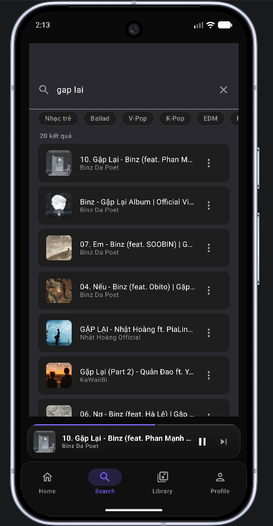
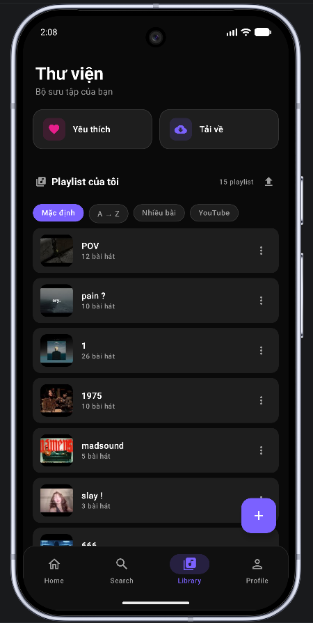

# Ultrapure Music

A personal music streaming Android app powered by YouTube — stream any track, sync your playlists, discover trending music, and get taste-based recommendations, all wrapped in a dark glassmorphism UI.

> **Self-hosted:** the Python/FastAPI backend streams audio via `yt-dlp` and runs on your own machine (or a VPS). The Android app connects to it over your local network or internet.

---

## Features

| Screen | What it does |
|--------|-------------|
| **Home** | Trending tracks, community playlists from YouTube, popular tracks, personalised recommendations, recently played |
| **Search** | Full-text search backed by yt-dlp / YouTube Data API |
| **Player** | Full-screen player + persistent mini-player, play queue, shuffle, repeat (one / all), crossfade, sleep timer, playback speed |
| **Library** | Your playlists — synced from YouTube or created locally |
| **Favourites** | Like/unlike songs, persisted offline in Room |
| **Downloads** | Cache songs locally (up to 500 MB, configurable) with disk-space guards |
| **History** | Recently played log + most-played + community popular |
| **Profile** | Sign in with Google; connect your YouTube account to pull subscriptions & playlist feed |
| **Settings** | Theme (dark/light/dynamic), audio quality, crossfade, EQ presets, bass boost, loudness, cache management |
| **Lyrics** | Synced (LRC) and plain text lyrics via LRCLib proxy |
| **Widget** | Home screen widget with playback controls |
| **Android Auto** | Full Android Auto support |

---

## Screenshots

Upload your screenshots to the `screenshots/` folder and they will appear here:

<p align="center">
  
  
  
  
  
  
</p>

---

## Tech Stack

### Android (`frontend/Android`)

| Layer | Library / Tool |
|-------|---------------|
| Language | Kotlin 2.2.10 |
| UI | Jetpack Compose + Material3 (BOM 2024.12.01) — glassmorphism design |
| DI | Hilt 2.59.2 |
| Navigation | Navigation Compose 2.8.5 — 14 screens |
| Networking | Retrofit 2.11.0 + OkHttp 4.12.0 + kotlinx.serialization |
| Local DB | Room 2.8.4 (5 entities, offline-first for favorites/history) |
| Preferences | DataStore 1.1.2 + EncryptedSharedPreferences |
| Playback | Media3 ExoPlayer 1.5.0 (HLS + DASH + progressive), MediaSessionService for background playback |
| Images | Coil 3.0.4 with OkHttp integration |
| Auth | Google Sign-In (play-services-auth 21.3.0) + YouTube OAuth |
| Build | AGP 9.2.1, Gradle 9.4.1, KSP 2.2.10-2.0.2 |

### Python Backend (`backend/`)

| Layer | Library / Tool |
|-------|---------------|
| Framework | FastAPI 0.115.0 + Uvicorn 0.30.6 |
| Audio extraction | yt-dlp ≥ 2024.12.0 |
| Database | SQLite via aiosqlite (async, WAL mode, foreign keys) |
| Auth | Google OAuth2 (google-auth, google-api-python-client) |
| JWT | PyJWT 2.9.0 — dual tokens: access (24h) + stream (1h) |
| Validation | Pydantic v2 + pydantic-settings |
| Scheduling | APScheduler 3.10.4 — cache cleanup, YouTube sync |
| HTTP | httpx 0.28.0 |
| Rate Limiting | Custom in-memory middleware (60 req/min/IP) |

### Architecture

**Clean Architecture** — three layers per feature:

```
Presentation  →  ViewModel (StateFlow) → Compose UI
Domain        →  Use Cases + Repository interfaces
Data          →  Repository impls (Remote + Local DataSources)
```

---

## Project Structure

```
UltrapureMusic/
├── backend/                        # FastAPI backend
│   ├── app/
│   │   ├── api/v1/                 # REST endpoints (auth, player, search, playlists, …)
│   │   ├── config/                 # Settings (reads .env) + constants
│   │   ├── db/                     # SQLite, migrations, repositories
│   │   ├── schemas/                # Pydantic request/response models
│   │   ├── services/               # Business logic, yt-dlp wrapper, YouTube API
│   │   ├── tasks/                  # Scheduled jobs (sync, cache cleanup)
│   │   └── utils/                  # JWT, rate limiter, exceptions, logger
│   ├── data/                       # Runtime data (gitignored DB + caches)
│   ├── tests/                      # Pytest tests
│   ├── .env.example                # ← copy to .env and fill in
│   └── requirements.txt
│
└── frontend/Android/               # Android app (Gradle project)
    ├── app/
    │   ├── google-services.json.example  # ← replace with your real file
    │   └── src/main/java/com/ultrapuremusic/
    │       ├── core/               # auth, database, di, player, ui, util
    │       ├── data/               # models, DTOs, repositories, data sources
    │       ├── domain/             # repository interfaces, use cases
    │       ├── feature/            # home, search, player, library, profile…
    │       └── service/            # MusicService (MediaSession / foreground)
    ├── gradle/                     # Gradle wrapper + version catalog
    ├── build.gradle.kts
    ├── settings.gradle.kts
    ├── gradle.properties
    └── local.properties.example    # ← copy to local.properties and fill in
```

---

## API Endpoints (Backend)

| Prefix | Description |
|--------|-------------|
| `GET /` | Health check |
| `/api/v1/auth` | Google OAuth sign-in / sign-out |
| `/api/v1/search` | Track search (yt-dlp, cached 5 min) |
| `/api/v1/player` | Stream URL resolution (cached 2 min) |
| `/api/v1/playlists` | CRUD for playlists, import/export text |
| `/api/v1/youtube-sync` | Sync playlists from a user's YouTube account |
| `/api/v1/recommendations` | Taste-based track recommendations (cached 30 min) |
| `/api/v1/favorites` | Like / unlike tracks |
| `/api/v1/history` | Playback history, most-played, popular |
| `/api/v1/lyrics` | Proxy for LRCLib (synced + plain lyrics) |
| `/api/v1/downloads` | Cache stats & clearing |

Full schema at `http://localhost:8000/docs` (Swagger UI) or `/redoc`.

---

## Getting Started

### Prerequisites

- **Android Studio** Ladybug (2024.2) or newer
- **Python 3.11+**
- A **Firebase project** (free Spark plan is enough)
- A **Google Cloud project** with these APIs enabled:
  - YouTube Data API v3
  - Google Sign-In / OAuth2

### 1 — Clone

```bash
git clone https://github.com/zienshang/Ultrapure-Music.git
cd Ultrapure-Music
```

### 2 — Backend setup

```bash
cd backend

# Create and activate a virtual environment
python -m venv venv
source venv/bin/activate        # Windows: venv\Scripts\activate

# Install dependencies
pip install -r requirements.txt

# Configure secrets
cp .env.example .env
# Open .env and fill in your values (see Secrets Reference below)

# Run the server (default: http://localhost:8000)
uvicorn app.main:app --reload
```

The interactive API docs are available at `http://localhost:8000/docs`.

### 3 — Android setup

#### 3a. Firebase / google-services.json

1. Go to [Firebase Console](https://console.firebase.google.com) → your project → **Project Settings** → **Your apps**.
2. Add an Android app with package name `com.ultrapuremusic`.
3. Add your debug SHA-1 fingerprint (run `./gradlew signingReport` to get it).
4. Download `google-services.json` and place it at `frontend/Android/app/google-services.json`.

#### 3b. local.properties

```bash
cd frontend/Android
cp local.properties.example local.properties
```

Edit `local.properties`:

```properties
sdk.dir=/path/to/your/Android/Sdk

# YouTube Data API v3 key (used by the Android app for search & metadata fallback)
youtubeApiKey=YOUR_YOUTUBE_DATA_API_V3_KEY
```

#### 3c. Backend URL

By default the app connects to `http://10.0.2.2:8000/` (the Android emulator's alias for localhost). If you're running on a physical device or a remote server, edit `BASE_URL` in `frontend/Android/app/src/main/java/com/ultrapuremusic/core/util/Constants.kt`.

#### 3d. Open in Android Studio

Open the `frontend/Android/` folder in Android Studio, sync Gradle, and run on a device or emulator (API 26+).

---

## Secrets Reference

### `backend/.env`

| Variable | Description |
|----------|-------------|
| `SECRET_KEY` | Random secret for signing JWTs — generate with `python -c "import secrets; print(secrets.token_urlsafe(48))"` |
| `GOOGLE_CLIENT_ID` | OAuth 2.0 Web client ID from [Google Cloud Console](https://console.cloud.google.com) → Credentials |
| `GOOGLE_CLIENT_SECRET` | Matching client secret |
| `GOOGLE_REDIRECT_URI` | Must match the URI registered in Google Cloud Console |
| `YOUTUBE_API_KEY` | YouTube Data API v3 key (server-side calls) |

### `frontend/Android/local.properties`

| Property | Description |
|----------|-------------|
| `youtubeApiKey` | YouTube Data API v3 key (injected into `BuildConfig.YOUTUBE_API_KEY` at compile time) |

> **Neither file is committed.** See `.gitignore` and the corresponding `.example` files for the expected structure.

---

## Security Notes

- `google-services.json` and `local.properties` are gitignored — never commit them.
- `backend/.env` is gitignored — never commit it.
- API keys are injected at build time via `BuildConfig`; they are not stored in source code.
- The git history has been scrubbed with `git filter-repo` to ensure no credentials appear in any past commit.
- JWT tokens have separate types and expiration: access tokens (24h) and stream tokens (1h).

---

## License

This project is released for personal / educational use. No warranty is provided.
